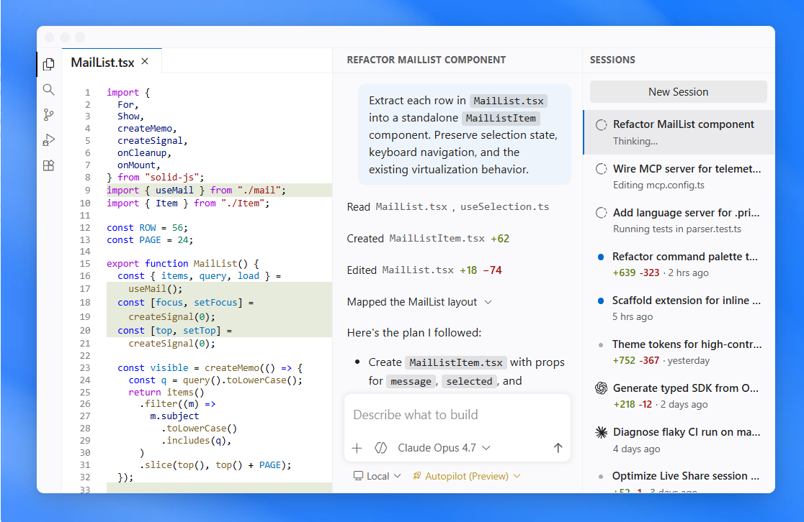

# VS Code Clone

A front-end clone of the Visual Studio Code landing page built using HTML and CSS. This project recreates the modern design and layout of the VS Code website to practice responsive web development and UI design.

## 🚀 Features

- Responsive landing page
- Modern VS Code-inspired design
- Navigation bar
- Hero section
- Feature cards and sections
- Clean and user-friendly interface

## 🛠️ Technologies Used

- HTML5
- CSS3

## 📂 Project Structure

```
VSCode-Clone/
│── index.html
│── heading.png.png
```

## ▶️ How to Run

1. Clone the repository:

```bash
git clone https://github.com/sindhu-p005/VSCode-Clone.git
```

2. Open the project folder.

3. Double-click `index.html` or open it using Live Server in Visual Studio Code.

## 📸 Screenshot

Add a screenshot of your project here.

Example:

```markdown

```

## 🎯 Learning Outcomes

- Improved HTML and CSS skills
- Learned responsive web page design
- Practiced recreating real-world website layouts
- Enhanced understanding of UI/UX principles

## 📈 Future Improvements

- Add JavaScript for interactive elements
- Improve responsiveness for all screen sizes
- Include animations and hover effects

## 👩‍💻 Author

**Sindhu Patil**

GitHub: https://github.com/sindhu-p005

---

⭐ If you found this project helpful, feel free to star the repository!
